# ElasticSearch学习

## 数据类型 

[官网地址](https://www.elastic.co/guide/en/elasticsearch/reference/current/mapping-types.html#mapping-types)

###  核心数据类型 （Core data types）

[官网地址](https://github.com/elastic/elasticsearch/edit/7.8/docs/reference/mapping/types.asciidoc)

- **[string 串](https://www.elastic.co/guide/en/elasticsearch/reference/current/string.html)**

  [`text`](https://www.elastic.co/guide/en/elasticsearch/reference/current/text.html) 和 [`keyword`](https://www.elastic.co/guide/en/elasticsearch/reference/current/keyword.html)

- **[Number 数字](https://www.elastic.co/guide/en/elasticsearch/reference/current/number.html)**

  `long`，`integer`，`short`，`byte`，`double`，`float`，`half_float`，`scaled_float`

- **[Date 日期](https://www.elastic.co/guide/en/elasticsearch/reference/current/date.html)**

  `date`

- **[Date nanoseconds 日期纳秒](https://www.elastic.co/guide/en/elasticsearch/reference/current/date_nanos.html)**

  `date_nanos`

- **[Boolean 布尔型](https://www.elastic.co/guide/en/elasticsearch/reference/current/boolean.html)**

  `boolean`

- **[Binary 二进制](https://www.elastic.co/guide/en/elasticsearch/reference/current/binary.html)**

  `binary`

- **[Range 范围](https://www.elastic.co/guide/en/elasticsearch/reference/current/range.html)**

  `integer_range`，`float_range`，`long_range`，`double_range`，`date_range`，`ip_range`

###  复杂数据类型（Complex data types）

[官网地址](https://github.com/elastic/elasticsearch/edit/7.8/docs/reference/mapping/types.asciidoc)

- **[Object 对象](https://www.elastic.co/guide/en/elasticsearch/reference/current/object.html)**

  `object` 用于单个JSON对象

- **[Nested 嵌套对象](https://www.elastic.co/guide/en/elasticsearch/reference/current/nested.html)**

  `nested` 用于JSON对象数组

###  地理数据类型 （Geo data types）

[官网地址](https://github.com/elastic/elasticsearch/edit/7.8/docs/reference/mapping/types.asciidoc)

- **[Geo-point 地理位置](https://www.elastic.co/guide/en/elasticsearch/reference/current/geo-point.html)**

  `geo_point` 纬度/经度积分

- **[Geo-shape 地理形状](https://www.elastic.co/guide/en/elasticsearch/reference/current/geo-shape.html)**

  `geo_shape` 用于多边形等复杂形状

###  专用数据类型 （Specialised data types）

[官网地址](https://github.com/elastic/elasticsearch/edit/7.8/docs/reference/mapping/types.asciidoc)

- **[IP](https://www.elastic.co/guide/en/elasticsearch/reference/current/ip.html)**

  `ip` 用于IPv4和IPv6地址

- **[ Completion data type 完成数据类型](https://www.elastic.co/guide/en/elasticsearch/reference/current/search-suggesters.html#completion-suggester)**

  `completion` 提供自动完成建议

- **[Token count](https://www.elastic.co/guide/en/elasticsearch/reference/current/token-count.html)**

  `token_count` 计算字符串中令牌的数量

- **[mapper-murmur3](https://www.elastic.co/guide/en/elasticsearch/plugins/7.8/mapper-murmur3.html)**

  `murmur3` 在索引时计算值的哈希并将其存储在索引中

- **[mapper-annotated-text](https://www.elastic.co/guide/en/elasticsearch/plugins/7.8/mapper-annotated-text.html)**

  `annotated-text` 索引包含特殊标记的文本（通常用于标识命名实体）

- **[Percolator](https://www.elastic.co/guide/en/elasticsearch/reference/current/percolator.html)**

  接受来自query-dsl的查询

- **[Join](https://www.elastic.co/guide/en/elasticsearch/reference/current/parent-join.html)**

  为同一索引内的文档定义父/子关系

- **[Rank feature 排名功能](https://www.elastic.co/guide/en/elasticsearch/reference/current/rank-feature.html)**

  记录数字功能以提高查询时的点击率。

- **[Rank features 等级特征](https://www.elastic.co/guide/en/elasticsearch/reference/current/rank-features.html)**

  记录数字功能以提高查询时的点击率。

- **[Dense vector密集矢量](https://www.elastic.co/guide/en/elasticsearch/reference/current/dense-vector.html)**

  记录浮点值的密集向量。

- **[Sparse vector 稀疏矢量](https://www.elastic.co/guide/en/elasticsearch/reference/current/sparse-vector.html)**

  记录浮点值的稀疏向量。

- **[Search -as-you-type 按类型搜索](https://www.elastic.co/guide/en/elasticsearch/reference/current/search-as-you-type.html)**

  针对查询进行优化的类文本字段，以实现按需输入完成

- **[Alias 别名](https://www.elastic.co/guide/en/elasticsearch/reference/current/alias.html)**

  为现有字段定义别名。

- **[Flattened 展平](https://www.elastic.co/guide/en/elasticsearch/reference/current/flattened.html)**

  允许将整个JSON对象索引为单个字段。

- **[Shape 形状](https://www.elastic.co/guide/en/elasticsearch/reference/current/shape.html)**

  `shape` 对于任意笛卡尔几何。

- **[Histogram 直方图](https://www.elastic.co/guide/en/elasticsearch/reference/current/histogram.html)**

  `histogram` 用于百分位数聚合的预聚合数值。

- **[constant keyword 常数关键字](https://www.elastic.co/guide/en/elasticsearch/reference/current/constant-keyword.html)**

  `keyword`当所有文档具有相同值时的情况的 专业化。

###  数组 （Arrays）

[官网地址](https://github.com/elastic/elasticsearch/edit/7.8/docs/reference/mapping/types.asciidoc)

在Elasticsearch中，数组不需要专用的字段数据类型。默认情况下，任何字段都可以包含零个或多个值，但是，数组中的所有值都必须具有相同的数据类型。请参阅[数组](https://www.elastic.co/guide/en/elasticsearch/reference/current/array.html)。

###  多领域 (Multi-fieds)

[官网地址](https://github.com/elastic/elasticsearch/edit/7.8/docs/reference/mapping/types.asciidoc)

为不同的目的以不同的方式对同一字段建立索引通常很有用。例如，一个`string`字段可以映射为`text`用于全文搜索的字段，也可以映射为`keyword`用于排序或聚合的字段。或者，您可以使用[`standard`分析仪](https://www.elastic.co/guide/en/elasticsearch/reference/current/analysis-standard-analyzer.html)， [`english`](https://www.elastic.co/guide/en/elasticsearch/reference/current/analysis-lang-analyzer.html#english-analyzer)分析仪和 [`french`分析仪](https://www.elastic.co/guide/en/elasticsearch/reference/current/analysis-lang-analyzer.html#french-analyzer)索引文本字段。

这是*多领域*的目的。大多数数据类型通过[`fields`](https://www.elastic.co/guide/en/elasticsearch/reference/current/multi-fields.html)参数支持多字段。


## Rest风格说明

一种软件架构风格,而不是标准,只是提供了一组设计原则和约束条件。它主要用于客户端和服务器交互类的软件。基于这个风格设计的软件可以更简洁,更有层次,更易于实现缓存等机制。

| method | URL                                             | 描述                        |
| :----: | :---------------------------------------------- | :-------------------------- |
|  PUT   | localhost:9200/索引名称/类型名称/文档Id         | 创建/修改文档（指定文档Id） |
|  POST  | localhost:9200/索引名称/类型名称                | 创建文档（随机文档Id）      |
|  POST  | localhost:9200/索引名称/类型名称/文档Id/_update | 修改文档                    |
| DELETE | localhost:9200/索引名称/类型名称/文档Id         | 删除文档                    |
|  GET   | localhost:9200/索引名称/类型名称/文档Id         | 查询文档 通过文档Id         |
|  POST  | localhost:9200/索引名称/类型名称/_search        | 查询所有文档                |

## 索引的基本操作

### 创建一个索引

```
PUT /索引名/~类型名~ /文档Id
{
	请求体
}
```


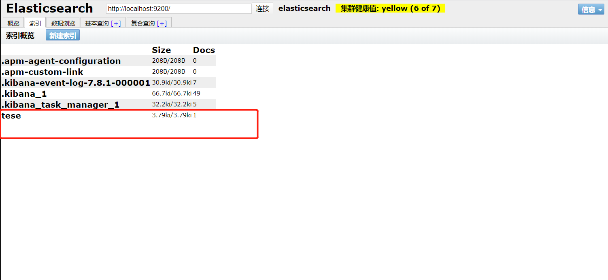

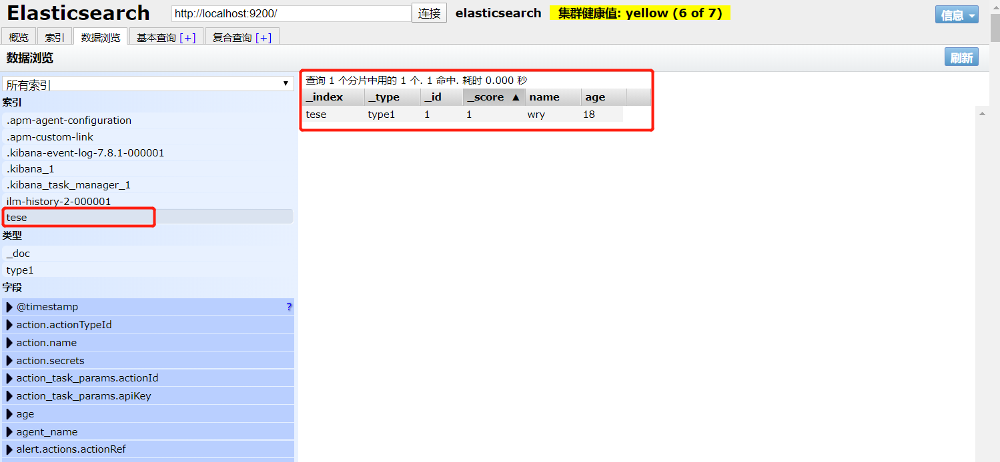

### 定义一个设置数据类型的索引

```json
PUT /test1
{
  "mappings": {
    "properties": {
      "name":{
        "type": "text"
      },
      "age":{
        "type": "long"
      },
      "birthday":{
        "type": "date"
      }
    }
  }
}
```

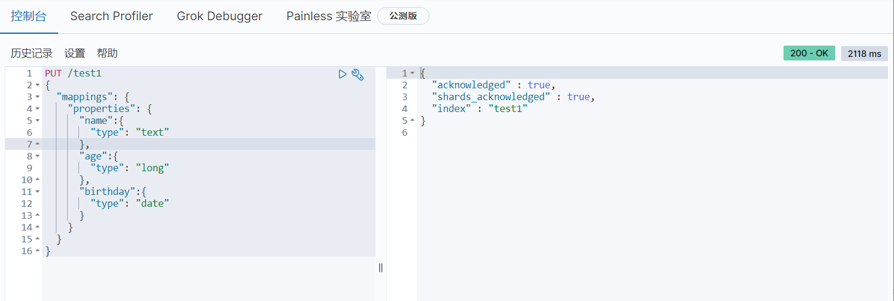

### 获取索引信息

```json
GET /test1
```

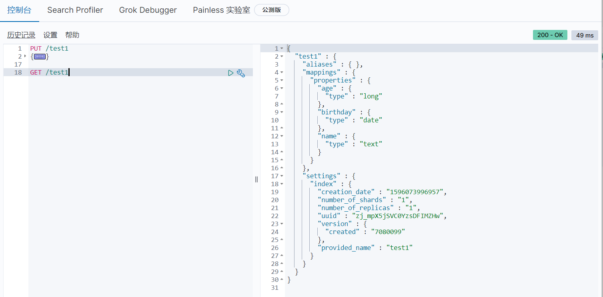

### 查看默认信息

7.8以后文档类型默认`_doc`

```json
PUT /test2/_doc/1
{
  "name":"王瑞玉",
  "age":24,
  "birthday":"1997-10-15"
}
```
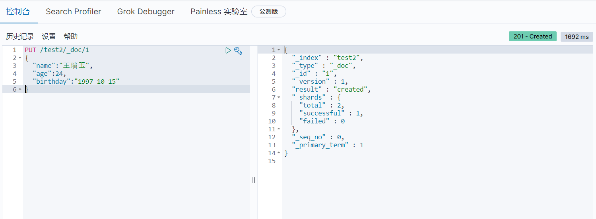

查看默认信息

``` 
GET /test2
```
如果自己得文档字段没有指定，那么ES 就会自己给我们默认设置字段类型！

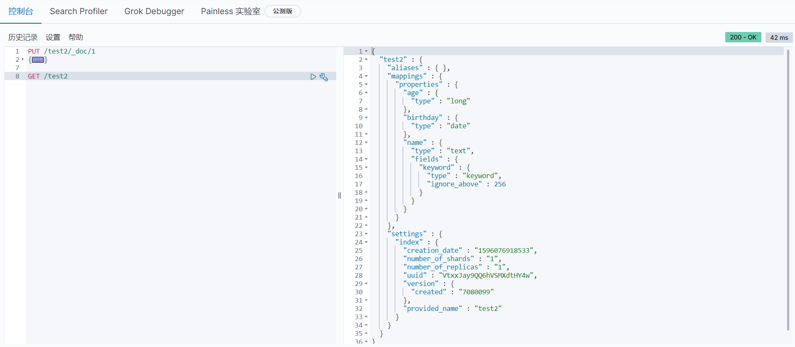


### 扩展查询

可以通过`_cat`命令查看es更多的信息

查看检查值

```
GET _cat/health
```

包含的信息

```
GET _cat/indices?v
```


### 修改索引

- 直接覆盖

  ```
  PUT /test2/_doc/1
  {
    "name":"王瑞玉123",
    "age":24,
    "birthday":"1997-10-15"
  }
  ```

  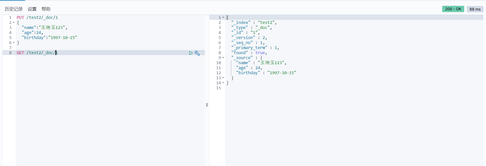

- 修改

  ```json
  POST /test2/_doc/1/_update
  {
    "doc":{
      "name":"法外狂徒张三"
    }
  }
  ```

  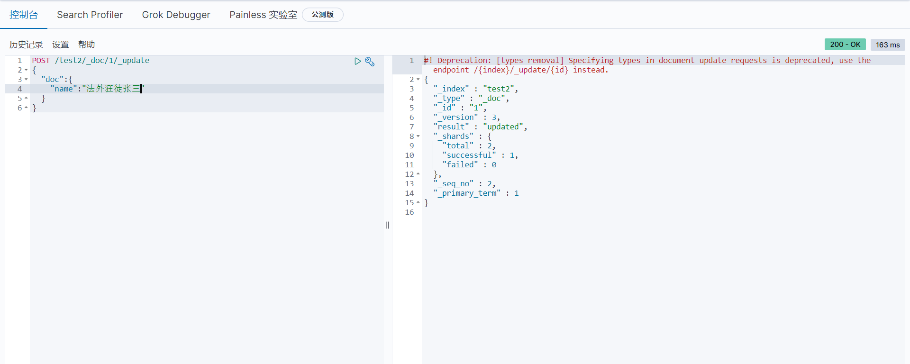

版本号会增加，状态更新。

### 删除索引

```json
DELETE test
```


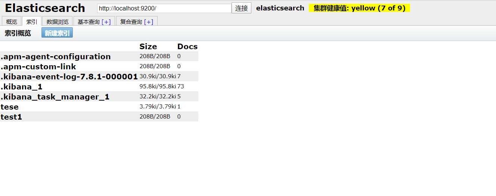

## 文档的操作

### 基本操作

#### 添加文档数据
```json
PUT /wry/_doc/1
{
  "name":"wry",
  "age":23,
  "desc":"一顿操作猛如虎，一看工资2500",
  "tags":["直男","IT","温暖"]
}

PUT /wry/_doc/2
{
  "name":"张三",
  "age":23,
  "desc":"法外狂徒",
  "tags":["直男"]
}

PUT /wry/_doc/3
{
  "name":"老干妈",
  "age":30,
  "desc":"不知道怎么形容",
  "tags":["靓女"]
}

PUT /wry/_doc/4
{
  "name":"张三SOS",
  "age":60,
  "desc":"SOS",
  "tags":["SOS"]
}

```

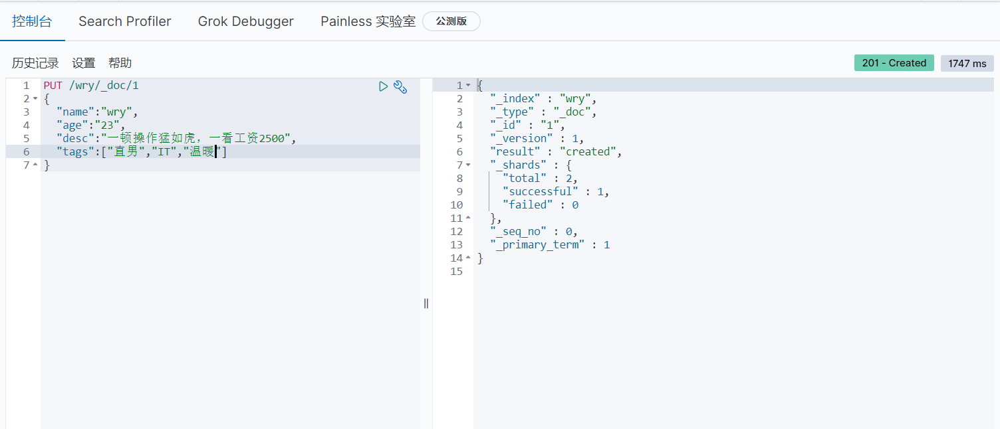

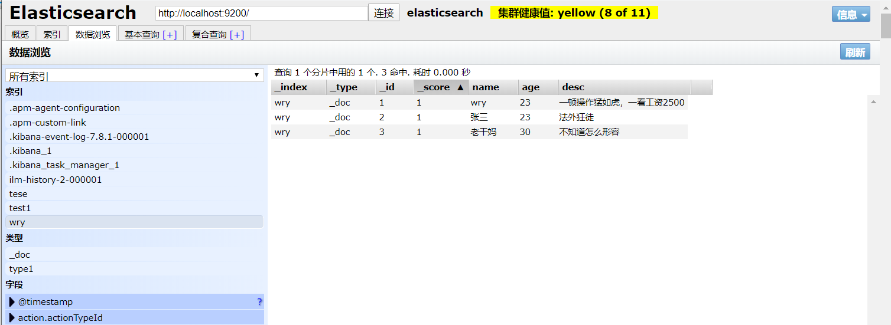

#### GET 获取文档数据
```
GET /wry/_doc/1
```

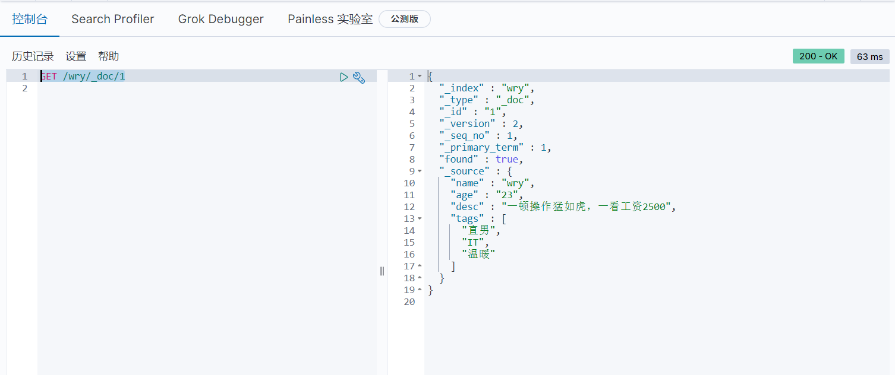

**`version` 代表记录被修改的次数**

#### 更新文档

##### PUT 更新文档数据 

```json
PUT /wry/_doc/5
{
  "name":"李四",
  "age":23,
  "desc":"一顿操作猛如虎，一看工资2500",
  "tags":["直男","IT","温暖"]
}
```

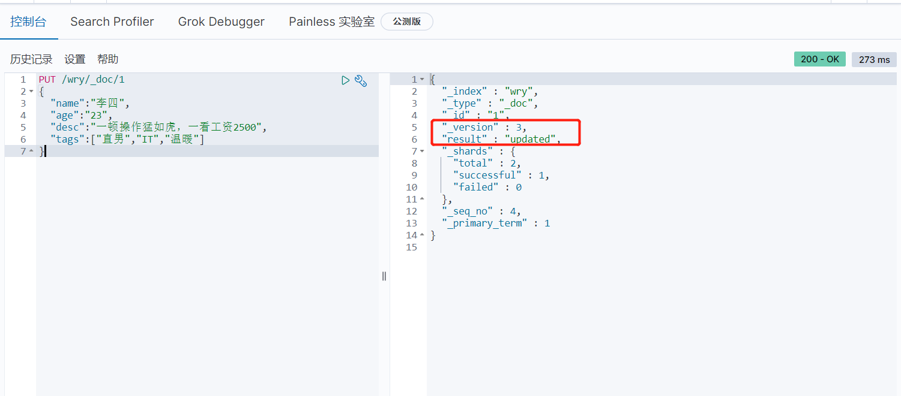
**`version` 代表记录被修改的次数**

`PUT`请求修改数据，如果请求体修改时少写字段，会丢失。

##### POST 更新文档数据 (推荐使用)

```json
POST /wry/_doc/1/_update
{
  "doc": {
    "age": 50
  }
}
```

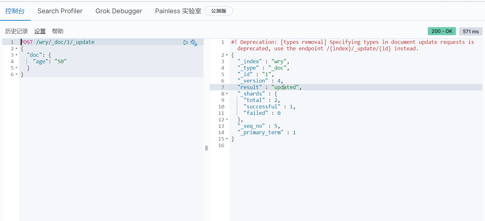

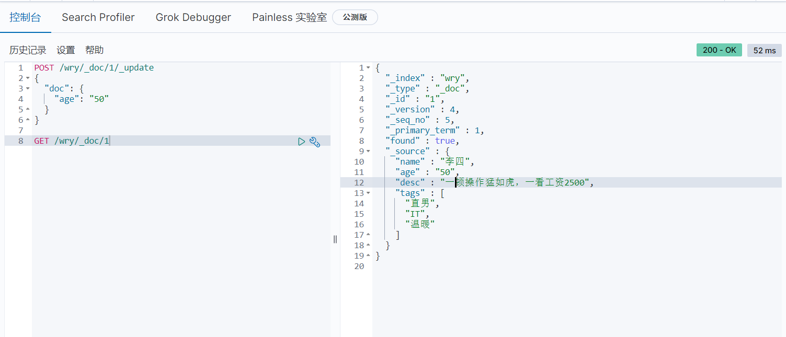


#### 简单条件查询

查询name等于李四的数据：

```json
GET /wry/_doc/_search?q=name:李四
```

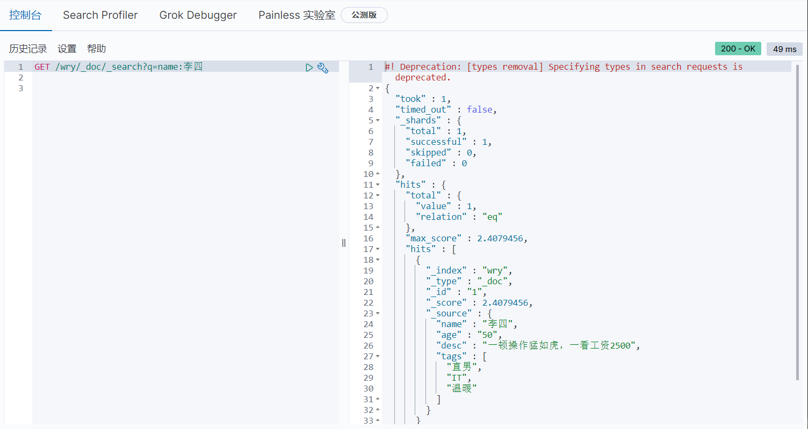

**`_score` 查询的匹配度越高分数越高**

### 复杂操作

#### 精确匹配
```json
GET /wry/_doc/_search
{
  "query":{
    "match":{
      "name":"张三"
    }
  }
}
```
精确匹配文档内容 name是Key,张三是Value

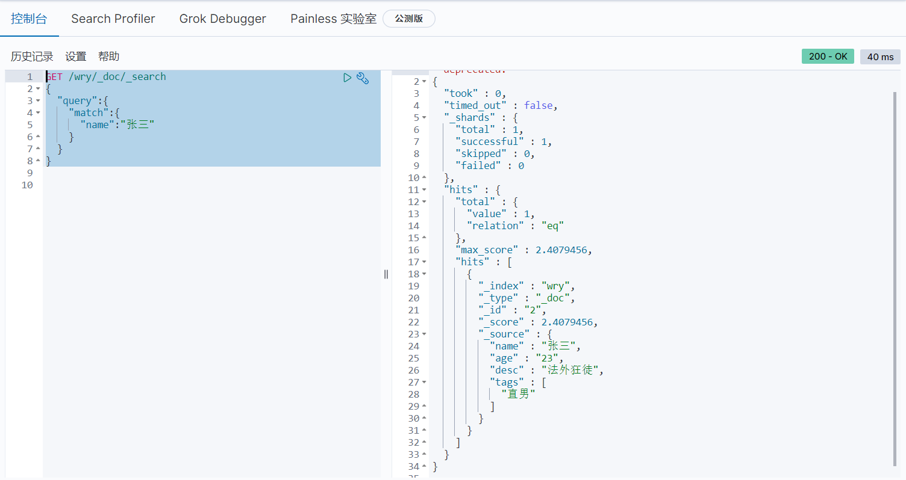

#### 字段过滤
```json
GET /wry/_doc/_search
{
  "query":{
    "match": {
      "name":"张三"
    } 
  },
  "_source":["name","age"]
}

```
使用`_source`选择需要查询的字段

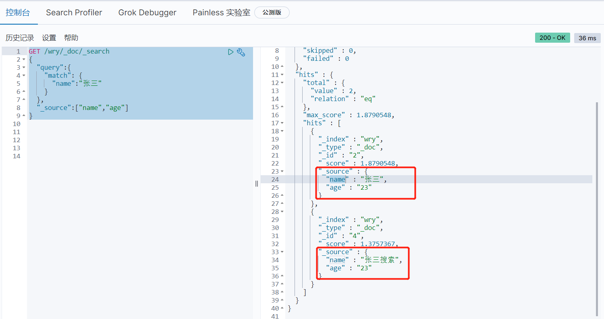

#### 字段排序

```json
GET /wry/_doc/_search
{
  "query": {
    "match": {
      "name": "张三"
    }
  },
  "sort": [
    {
      "age":{
        "order":"desc"
      }
    }
  ]
}
```
使用`sort`进行排序，指定字段和排序方式
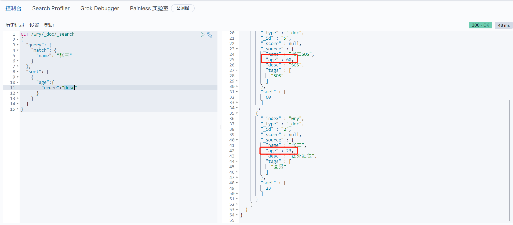


```json
GET /wry/_doc/_search
{
  "query": {
    "match": {
      "name": "张三"
    }
  },
  "sort": [
    {
      "age":{
        "order":"asc"
      }
    }
  ]
}
```

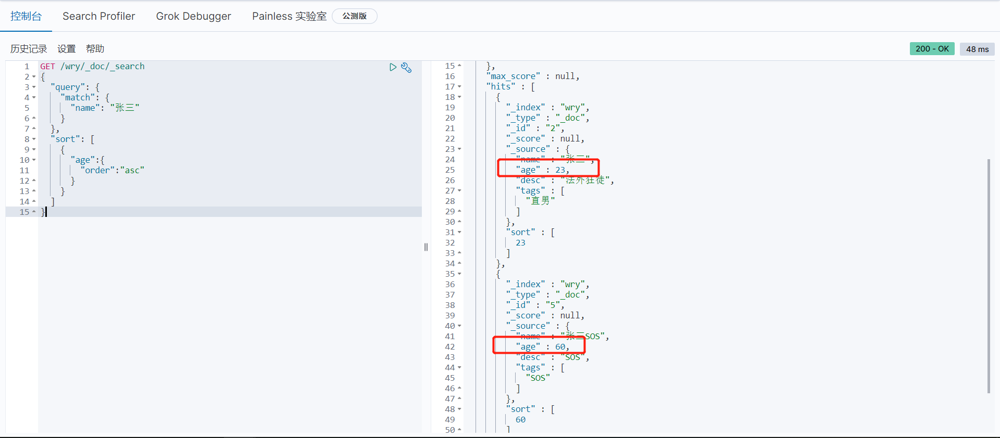


#### 分页查询
```json
GET /wry/_doc/_search
{
  "query": {
    "match": {
      "name": "张三"
    }
  },
  "from":0,
  "size":1
}
```
`form` 从那条记录开始，`size` 每页显示多少条记录  

**数据下标是从`0`开始**
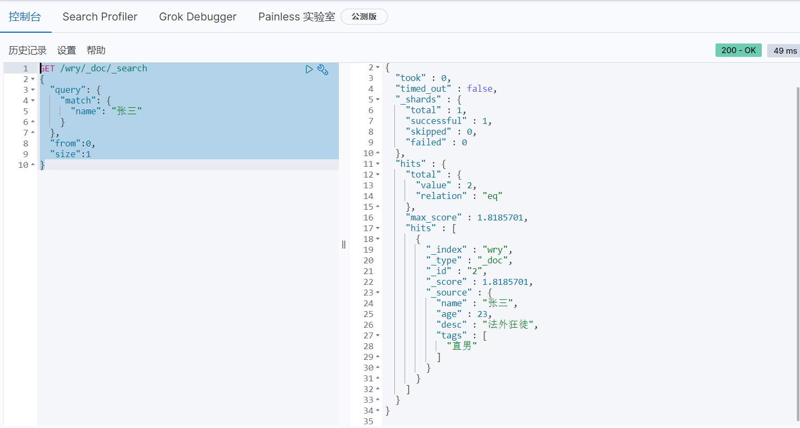

#### 布尔值查询 多条件匹配 

#### 且条件查询 

`must` (相当于MySQL中的`and`) 所有条件都要符合

```json
GET /wry/_doc/_search
{
  "query": {
    "bool": {
      "must": [
        {
          "match": {
            "name": "张三"
          }
        },
        {
          "match": {
            "desc": "SOS"
          }
        }
      ]
    }
  }
}
```

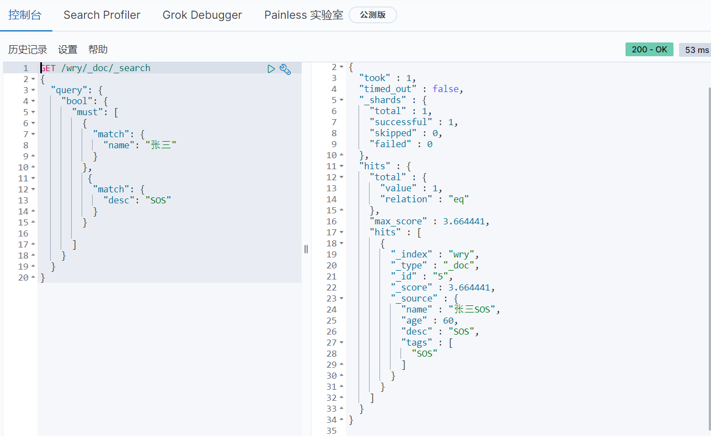
#### 或条件查询

`should` (相当于MySQL中的`or`) 条件符合一个就可以

```json
GET /wry/_doc/_search
{
  "query": {
    "bool": {
      "should": [
        {
          "match": {
            "name": "张三"
          }
        },
        {
          "match": {
            "desc": "SOS"
          }
        }
      ]
    }
  }
}
```

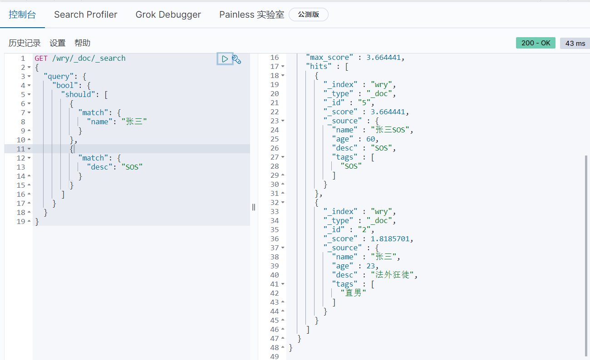

#### 不包含查询
`must_not` （相当于MySQL中的`not`）

```json

GET /wry/_doc/_search
{
  "query": {
    "bool": {
      "must_not": [
        {
          "match": {
            "name": "张三"
          }
        },
        {
          "match": {
            "desc": "SOS"
          }
        }
      ]
    }
  }
}
```

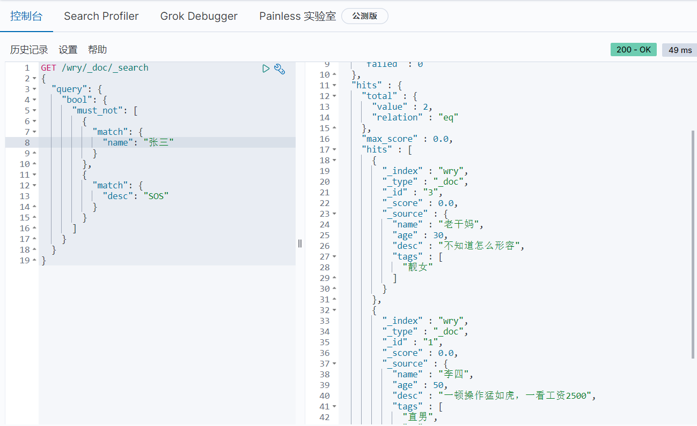


#### 过滤条件查询
`gt` 大于 （相当于MySQL中的`>`）   
`gte` 大于等于 （相当于MySQL中的`>=`）    
`lt` 小于 （相当于MySQL中的`<`）  
`lte` 小于等于 （相当于MySQL中的`<=`）   
```json
GET /wry/_doc/_search
{
  "query": {
    "bool": {
      "must": [
        {
          "match": {
            "name": "张三"
          }
        }
      ],
      "filter":{
        "range":{
          "age":{
            "gt":10,
            "lt":40
          }
        }
      }
    }
  }
}
```

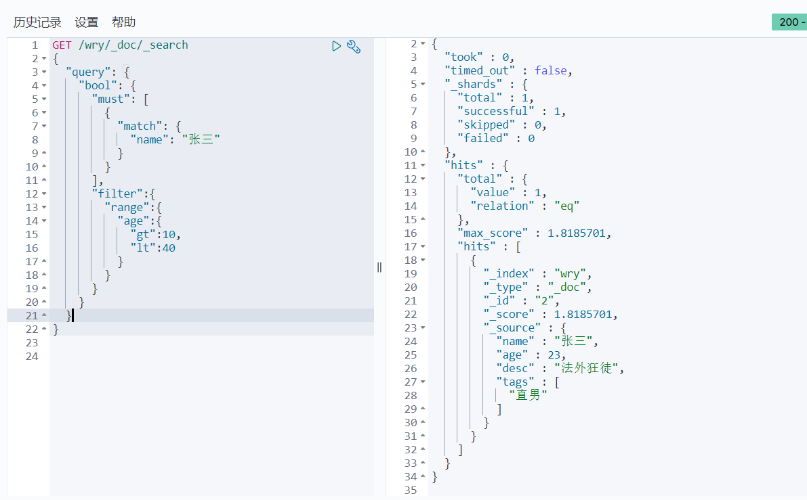


#### 匹配多个条件
多个字段空格隔开即可，分数(匹配度)高的优先匹配
```json
GET /wry/_search
{
  "query": {
    "match": {
      "tags": "女 it"
    }
  }
}

```

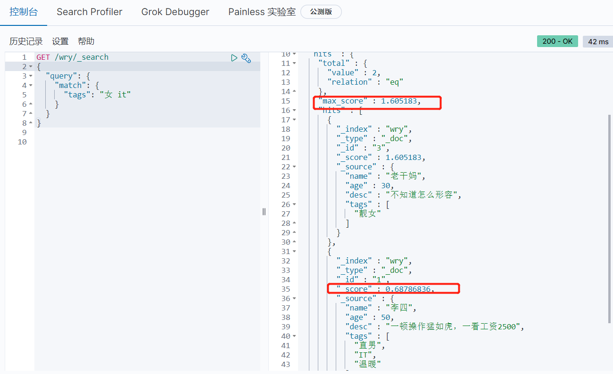

#### 精确查询

因为上边我们的索引库没有指定字段类型所以我们重新准备个测试索引。
##### 创建测试索引库
```json
PUT /testdb/
{
  "mappings": {
    "properties": {
      "name":{
        "type": "text"
      },
      "desc":{
        "type": "keyword"
      }
    }
  }
}
```

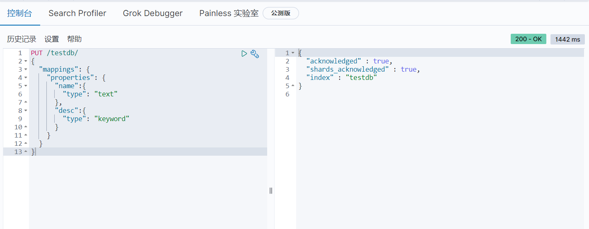

##### 准备测试文档

```json
PUT /testdb/_doc/1
{
  "name":"张三学习ElasticSearch",
  "desc":"法外狂徒"
}

PUT /testdb/_doc/2
{
  "name":"张三学习ElasticSearch",
  "desc":"逍遥的法外狂徒"
}
```

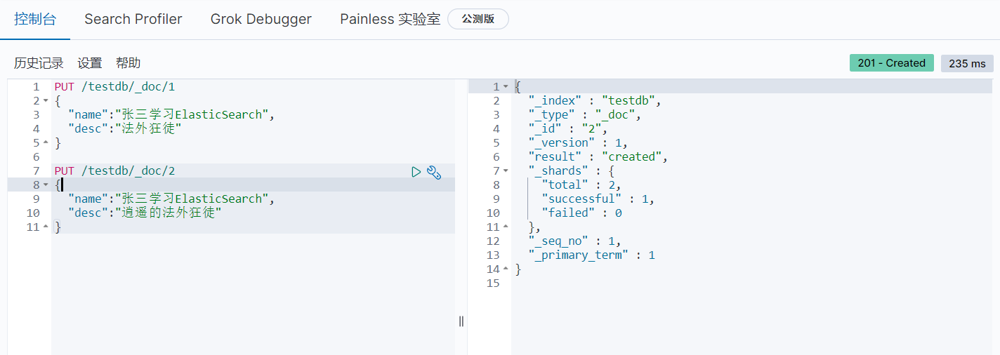


在这里发现一个坑，就是再`创建索引`的时候是`不用写类型`的,但是在插入数据的时候`必须指定文档类型`。否则会`报错`。  

**错误演示**

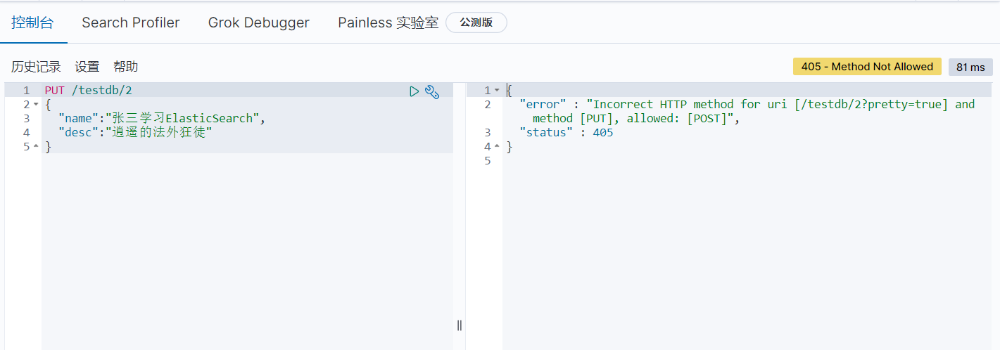

**我们重点说一下这里**

>**两个类型：**  
>`text`  会被分词器解析  
>`keyword` **不会**被分词器解析

使用分词器查询，类型为`keyword`,不会被分词器解析
```json
GET _analyze
{
  "analyzer": "keyword",
  "text": "张三学习ElasticSearch"
}
```

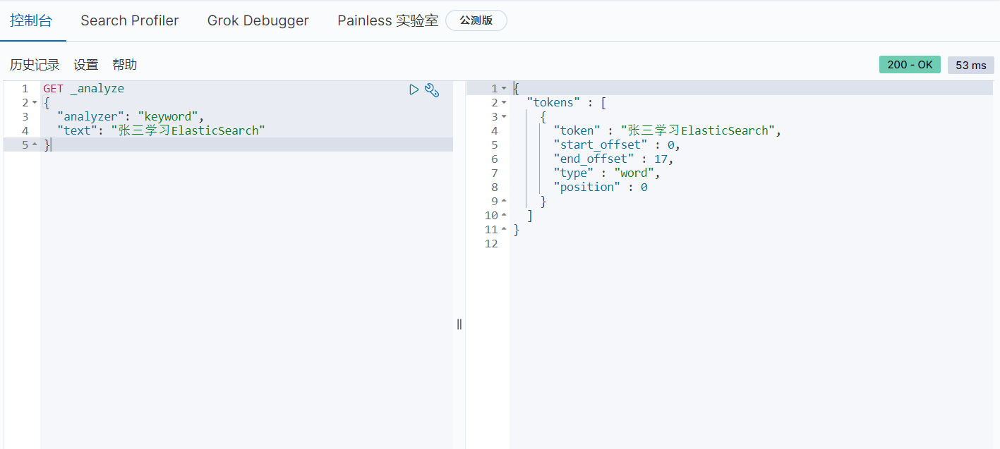

使用分词器查询，类型为标准`standard`,可以看到被分词器拆分了
```json
GET _analyze
{
  "analyzer": "standard",
  "text": "张三学习ElasticSearch"
}

```

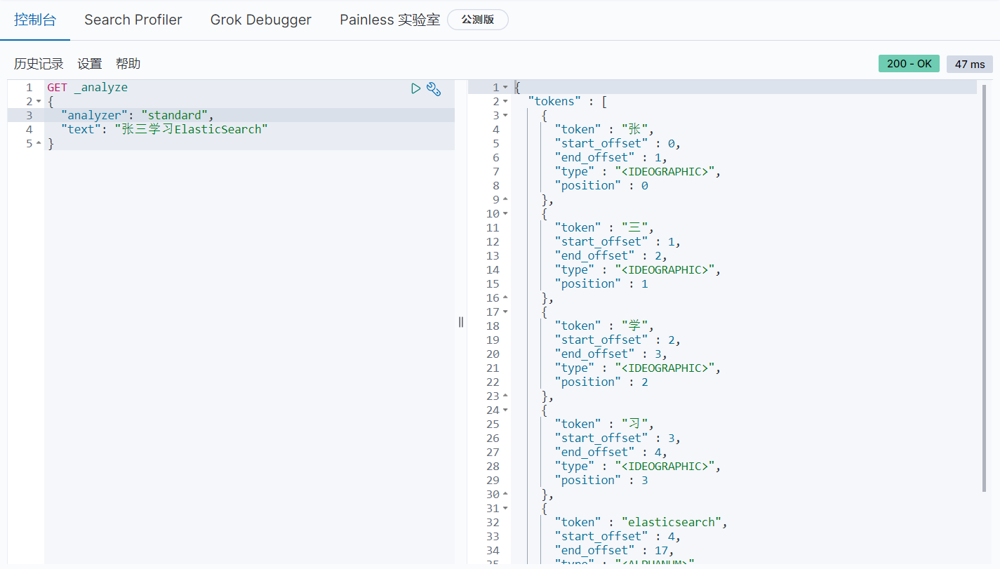

`name`属性是`text`类型，会被分词器进行解析处理成  【"张","三","学","习","elatsicsearch"】,  
所以查询的时候只有输入以上被解析后的结果才能匹配到值进行输出。

```json
GET /testdb/_search
{
  "query": {
    "term": {
      "name": "三"
    }
  }
}
```

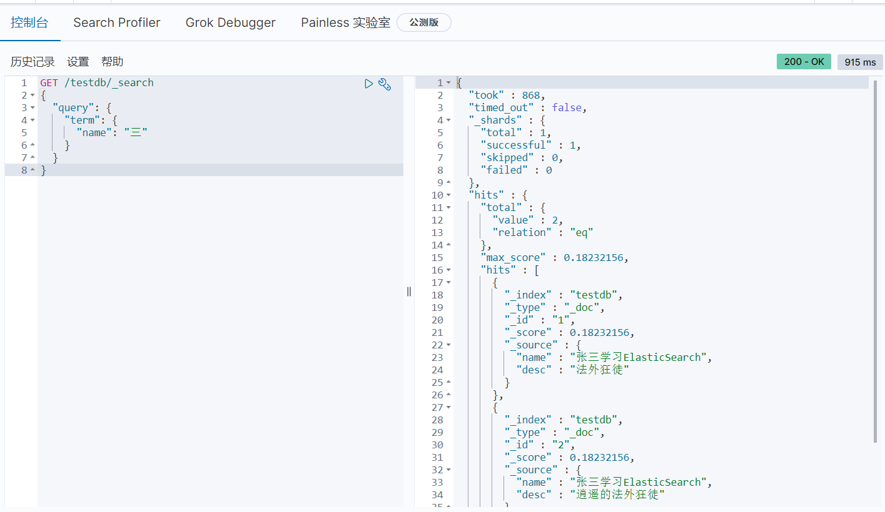

```json
GET /testdb/_search
{
  "query": {
    "term": {
      "name": "张"
    }
  }
}
```

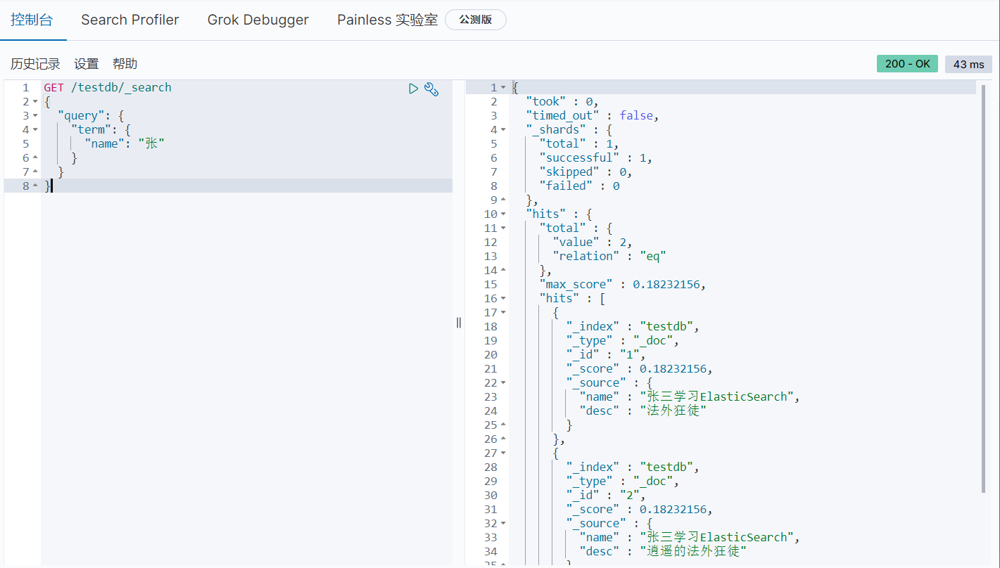


输入`不是被解析的结果`进行查询，`匹配不到输出结果`。

```json
GET /testdb/_search
{
  "query": {
    "term": {
      "name": "学习"
    }
  }
}
```

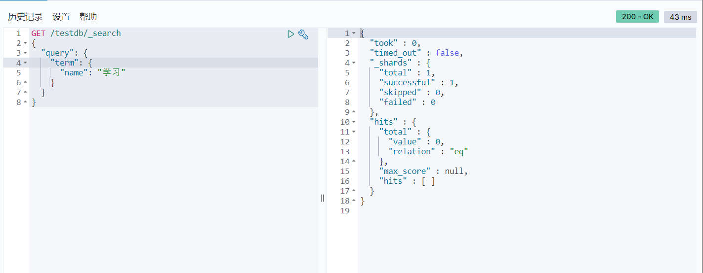

`desc`属性是`keyword`类型，不会被分词器进行解析。
```json
GET /testdb/_search
{
  "query": {
    "term": {
      "desc": "法外狂徒"
    }
  }
}
```
输入 `法外狂徒` 他会完全匹配，才能输出结果
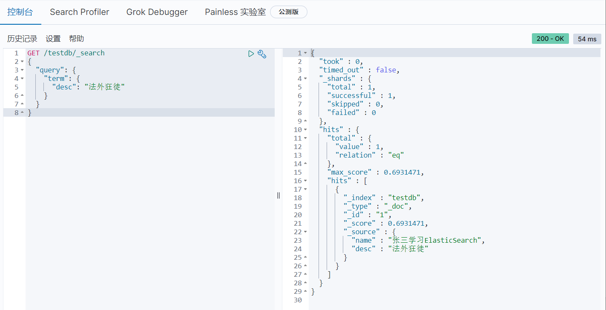

```json
GET /testdb/_search
{
  "query": {
    "term": {
      "desc": "逍遥的法外狂徒"
    }
  }
}
```
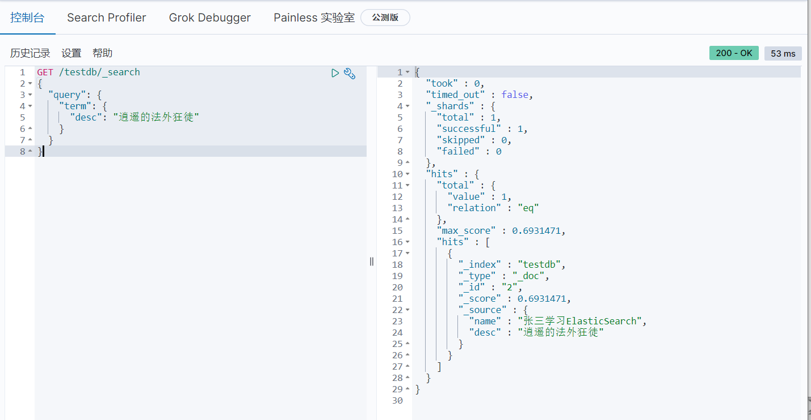

`term`查询是直接通过**倒排索引**指定的词条进行**精确查询**的。

>**关于分词：**  
>`term` 直接精确查询 （效率高）   
>`match` 会使用分词器解析(先分析文档，然后再通过分析的文档进行查询。)

#### 多个值匹配的精确查询

准备数据

```json
PUT /testdb/_doc/3
{
  "t1":"22",
  "t2":"2020-07-31"
}

PUT /testdb/_doc/4
{
  "t1":"22",
  "t2":"2020-05-31"
}

PUT /testdb/_doc/5
{
  "t1":"33",
  "t2":"2020-05-31"
}
```
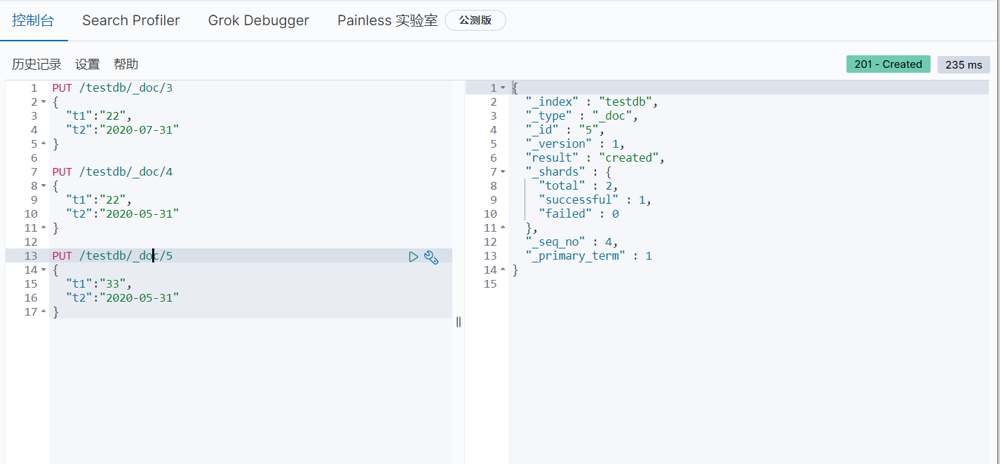

是不是在想`testdb索引`中没有`t1`和`t2`两个字段，
这样写会`动态新增`2个字段的


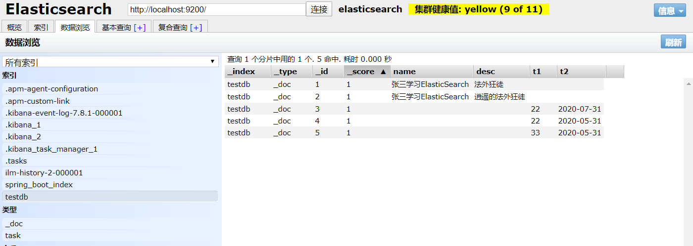

并且`默认指定了类型`， `t1`是`text`类型，`t2`是`date`类型。

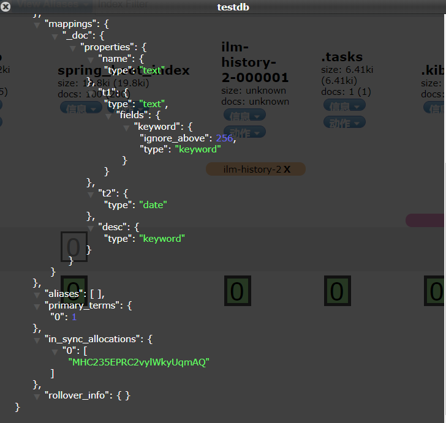


```json
GET /testdb/_search
{
  "query": {
    "bool": {
      "should": [
        {
          "term": {
            "t1": {
              "value": "33"
            }
          }
        },
        {
          "term": {
            "t2": {
              "value": "2020-05-31"
            }
          }
        }
      ]
    }
  }
}
```

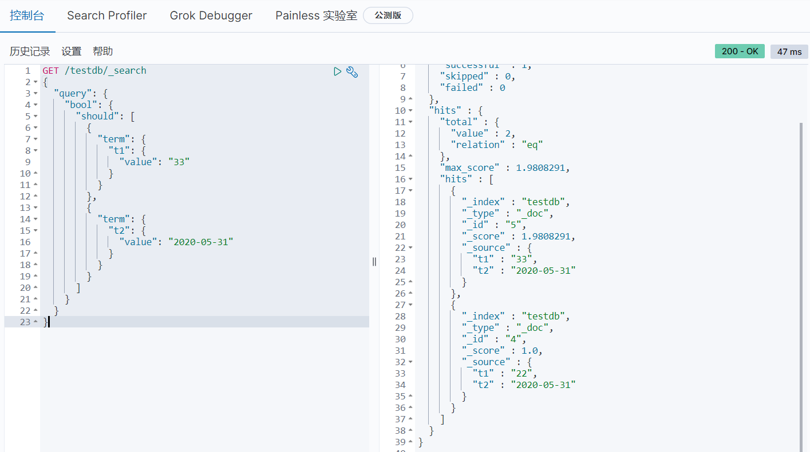


#### 高亮查询
使用以前的库进行查询
```json
GET /wry/_search
{
  "query": {
    "match": {
      "name": "张三"
    }
  },
  "highlight": {
    "fields": {
      "name": {}
    }
  }
}
```
高亮关键字被加了`<em></em>` 标签

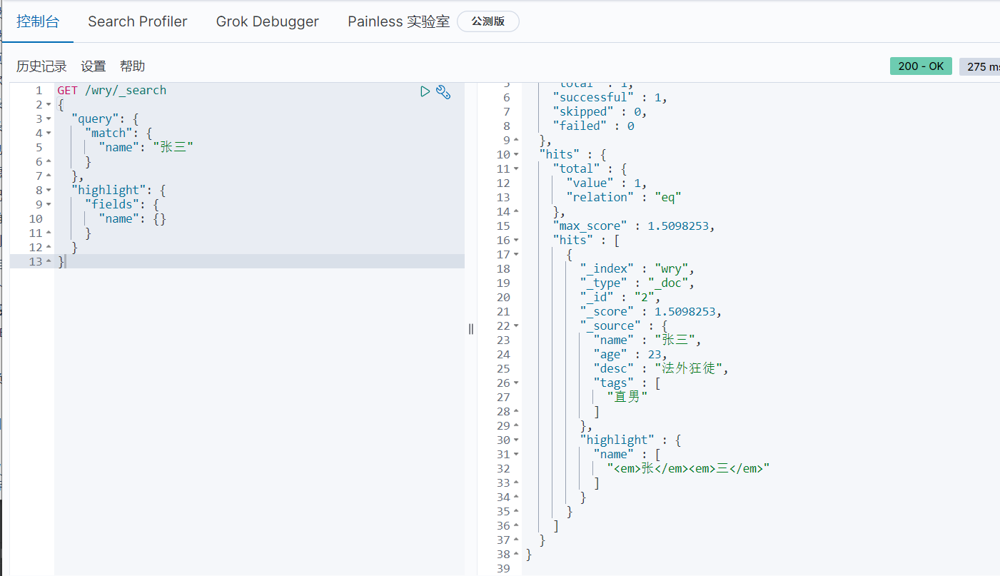

如果我们不想使用默认的，我们可以自己定义标签
```json
GET /wry/_search
{
  "query": {
    "match": {
      "name": "张三"
    }
  },
  "highlight": {
    "pre_tags": "<p class='key' style='color:red'>", 
    "post_tags": "</p>", 
    "fields": {
      "name": {}
    }
  }
}
```

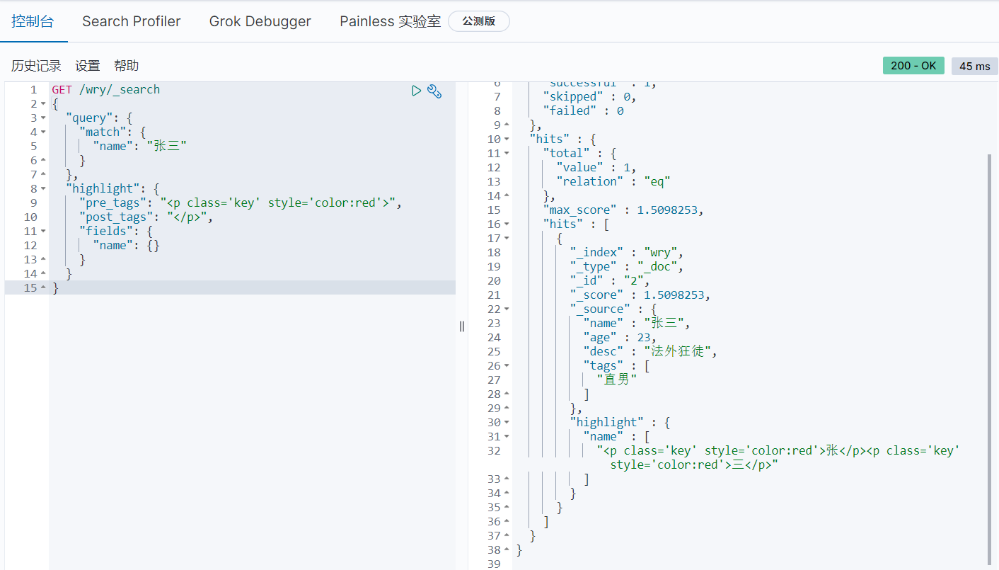

# 集成SpringBoot
## 找文档
[官网地址](https://www.elastic.co/guide/index.html)：https://www.elastic.co/guide/index.html  
[客户端集成](https://www.elastic.co/guide/en/elasticsearch/client/index.html)https://www.elastic.co/guide/en/elasticsearch/client/index.html

一般我们使用高级API

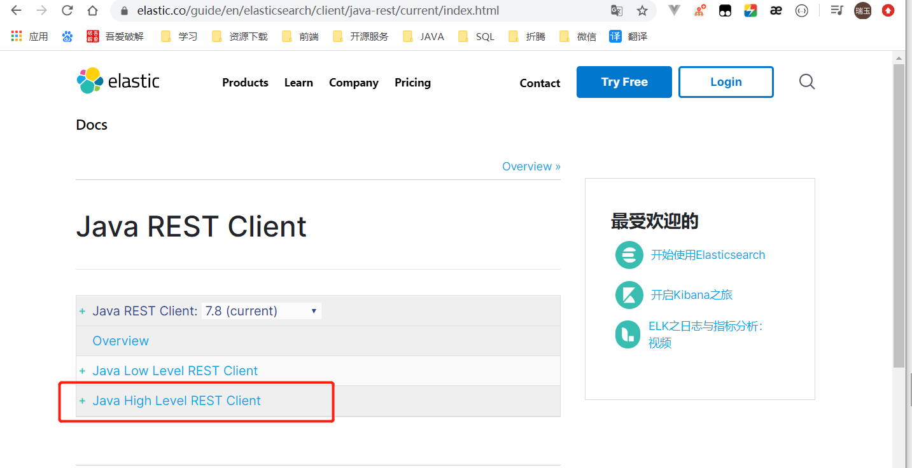

```xml
<dependency>
    <groupId>org.elasticsearch.client</groupId>
    <artifactId>elasticsearch-rest-high-level-client</artifactId>
    <version>7.8.1</version>
</dependency>
```
## 找对象

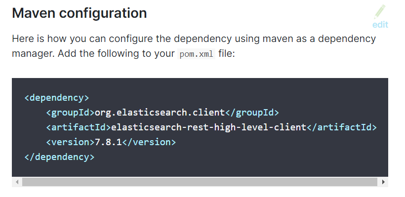

## 搭建项目
### pom
```xml
<?xml version="1.0" encoding="UTF-8"?>
<project xmlns="http://maven.apache.org/POM/4.0.0" xmlns:xsi="http://www.w3.org/2001/XMLSchema-instance"
	xsi:schemaLocation="http://maven.apache.org/POM/4.0.0 https://maven.apache.org/xsd/maven-4.0.0.xsd">
	<modelVersion>4.0.0</modelVersion>
	<parent>
		<groupId>org.springframework.boot</groupId>
		<artifactId>spring-boot-starter-parent</artifactId>
		<version>2.3.2.RELEASE</version>
		<relativePath/> <!-- lookup parent from repository -->
	</parent>
	<groupId>com.wry</groupId>
	<artifactId>es-api</artifactId>
	<version>0.0.1-SNAPSHOT</version>
	<name>es-api</name>
	<description>Spring Boot for ElasticSearch</description>

	<properties>
		<java.version>1.8</java.version>
	</properties>

	<dependencies>
		<dependency>
			<groupId>org.springframework.boot</groupId>
			<artifactId>spring-boot-starter-data-elasticsearch</artifactId>
		</dependency>
		<dependency>
			<groupId>org.springframework.boot</groupId>
			<artifactId>spring-boot-starter-web</artifactId>
		</dependency>

		<dependency>
			<groupId>org.springframework.boot</groupId>
			<artifactId>spring-boot-devtools</artifactId>
			<scope>runtime</scope>
			<optional>true</optional>
		</dependency>
		<dependency>
			<groupId>org.springframework.boot</groupId>
			<artifactId>spring-boot-configuration-processor</artifactId>
			<optional>true</optional>
		</dependency>
		<dependency>
			<groupId>org.projectlombok</groupId>
			<artifactId>lombok</artifactId>
			<optional>true</optional>
		</dependency>
		<dependency>
			<groupId>org.springframework.boot</groupId>
			<artifactId>spring-boot-starter-test</artifactId>
			<scope>test</scope>
			<exclusions>
				<exclusion>
					<groupId>org.junit.vintage</groupId>
					<artifactId>junit-vintage-engine</artifactId>
				</exclusion>
			</exclusions>
		</dependency>
	</dependencies>

	<build>
		<plugins>
			<plugin>
				<groupId>org.springframework.boot</groupId>
				<artifactId>spring-boot-maven-plugin</artifactId>
			</plugin>
		</plugins>
	</build>

</project>

```

SpringBoot默认使用7.6.2,与本地版本不一致会连接不成功。
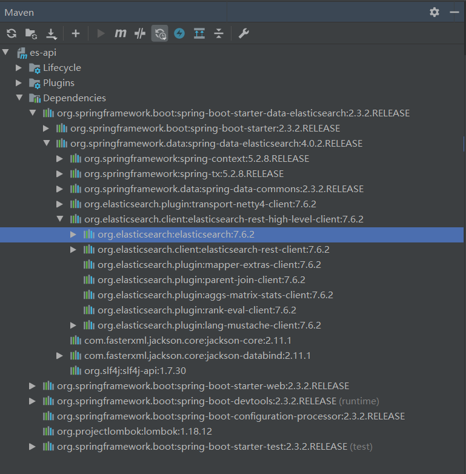

### 自定义es 版本依赖，与本地版本保持一直
```xml
	<properties>
		<java.version>1.8</java.version>
		<!--自定义es 版本依赖，与本地版本保持一直 -->
		<elasticsearch.version>7.8.1</elasticsearch.version>
	</properties>
```


### 自动配置
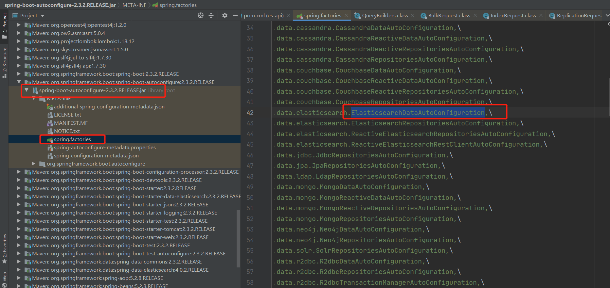

### application.yml
```yaml
server:
  port: 9000

spring:
  elasticsearch:
    rest:
      uris: http://localhost:9200

```

## 索引 API 操作

注入`ElasticSearch`的客户端对象`RestHighLevelClient`

```java
package com.wry.esapi;

import org.elasticsearch.client.IndicesClient;
import org.elasticsearch.client.RequestOptions;
import org.elasticsearch.client.RestHighLevelClient;
import org.elasticsearch.client.indices.CreateIndexRequest;
import org.elasticsearch.client.indices.CreateIndexResponse;
import org.junit.jupiter.api.Test;
import org.springframework.boot.test.context.SpringBootTest;

import javax.annotation.Resource;
import java.io.IOException;

@SpringBootTest
class EsApiApplicationTests {
    
    private final String INDEX_NAME="spring_boot_index";

    @Resource
    private RestHighLevelClient restHighLevelClient;
    
}

```

### 创建索引
```java
    /**
     * 创建索引
     *
     * @throws IOException
     */
    @Test
    void testCreateIndexRequest() throws IOException {
        //创建索引请求
        CreateIndexRequest request = new CreateIndexRequest(INDEX_NAME);
        //执行请求并获取响应结果
        IndicesClient indices = restHighLevelClient.indices();
        CreateIndexResponse response = indices.create(request, RequestOptions.DEFAULT);
        System.out.println(response.index());
    }
    
```


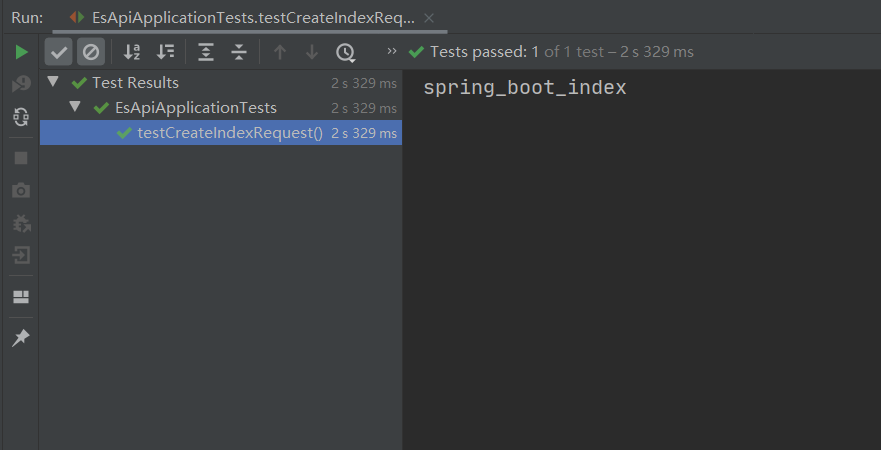

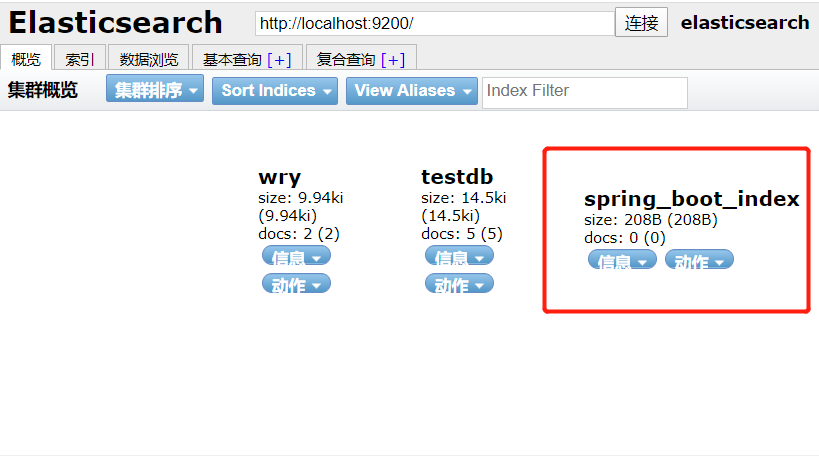


### 判断索引是否存在
```java
    /**
     * 判断索引是否存在
     *
     * @throws IOException
     */
    @Test
    void testExistsIndexRequest() throws IOException {
        //创建索引请求
        GetIndexRequest request = new GetIndexRequest(INDEX_NAME);
        //执行请求并获取响应结果
        boolean exists = restHighLevelClient.indices().exists(request, RequestOptions.DEFAULT);

        System.out.println(exists);
    }
    
```

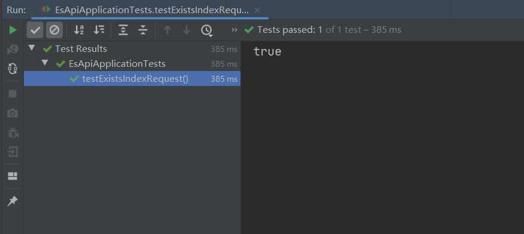

### 删除索引
```java

    /**
     * 删除索引
     *
     * @throws IOException
     */
    @Test
    void testDeleteIndexRequest() throws IOException {
        //创建索引请求
        DeleteIndexRequest request = new DeleteIndexRequest(INDEX_NAME);
        //执行请求并获取响应结果
        AcknowledgedResponse response = restHighLevelClient.indices().delete(request, RequestOptions.DEFAULT);

        System.out.println(response.isAcknowledged());
    }
```

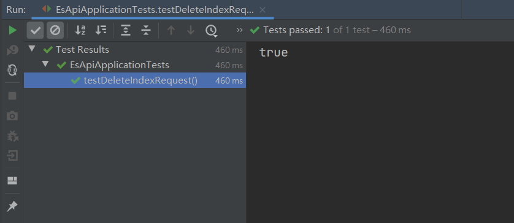

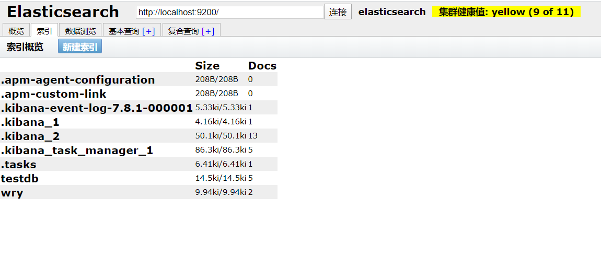

## 文档 API 操作
```java
package com.wry.esapi.pojo;

import lombok.AllArgsConstructor;
import lombok.Data;
import lombok.NoArgsConstructor;
import org.springframework.stereotype.Component;

/**
 * <p>
 * 创建一个User 对应提供全参，无参构造器
 * </p>
 *
 * @author wangruiyu
 * @since 2020/8/1
 */
@Data
@AllArgsConstructor
@NoArgsConstructor
@Component
public class User {
    
    private String name;
    private Integer age;
}

```
###  创建文档
```java
 	/**
     * 创建文档
     *
     * @throws IOException
     */    
	@Test
    void testAddDocumentRequest() throws IOException {
        //创建对象
        User user = new User("张三", 24);
        //创建文档请求
        IndexRequest indexRequest = new IndexRequest(INDEX_NAME);
        // PUT /spring_boot_index/_doc/1
        indexRequest.id("1");
        indexRequest.timeout(TimeValue.timeValueSeconds(1));

        //将对象转换为JSON
        ObjectMapper mapper=new ObjectMapper();
        indexRequest.source(mapper.writeValueAsString(user), XContentType.JSON);
        //执行请求并获取响应结果
        IndexResponse response = restHighLevelClient.index(indexRequest, RequestOptions.DEFAULT);
        System.out.println(response.toString());

    }

```

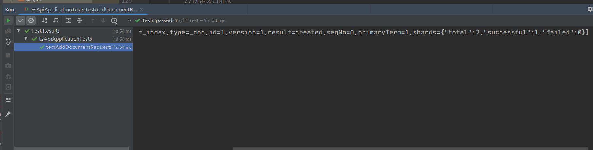

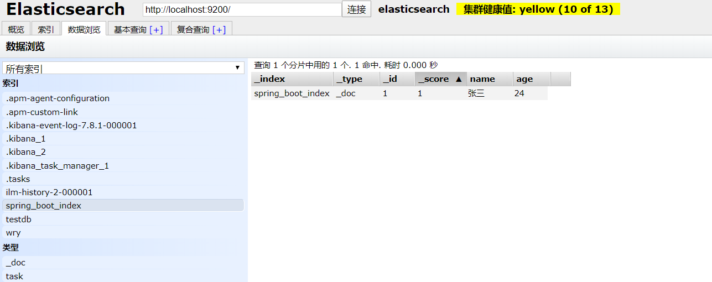

###  判断文档是否存在
```java
    /**
     * 判断文档是否存在
     *
     * @throws IOException
     */
    @Test
    void testExistsDocumentRequest() throws IOException {
        //创建文档请求
        //GET /spring_boot_index/_doc/1
        GetRequest getRequest = new GetRequest(INDEX_NAME, "1");
        //不获取返回的_source 的上下文
        getRequest.fetchSourceContext(new FetchSourceContext(false));
        //执行请求并获取响应结果
        GetResponse response = restHighLevelClient.get(getRequest, RequestOptions.DEFAULT);
        System.out.println(response.toString());

    }  

```

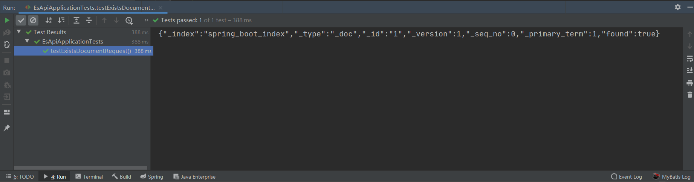

###  查询文档内容
```java

    /**
     * 查询文档内容
     *
     * @throws IOException
     */
    @Test
    void testGetDocumentRequest() throws IOException {
        //创建文档请求
        //GET /spring_boot_index/_doc/1
        GetRequest getRequest = new GetRequest(INDEX_NAME, "1");
        //执行请求并获取响应结果
        GetResponse response = restHighLevelClient.get(getRequest, RequestOptions.DEFAULT);
        System.out.println(response.getSourceAsString());
        System.out.println(response.toString());

    }

```

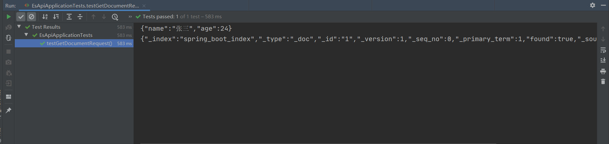

### 更新文档
```java

    /**
     * 更新文档内容
     *
     * @throws IOException
     */
    @Test
    void testUpdateDocumentRequest() throws IOException {
        //创建文档请求
        //POST /wry/_doc/1/_update
        UpdateRequest updateRequest = new UpdateRequest(INDEX_NAME, "1");
        updateRequest.timeout(TimeValue.timeValueSeconds(1));
        //创建对象
        User user=new User("张三",124);
        //将对象转换为JSON
        ObjectMapper mapper = new ObjectMapper();
        updateRequest.doc(mapper.writeValueAsString(user), XContentType.JSON);
        //执行请求并获取响应结果
        UpdateResponse response = restHighLevelClient.update(updateRequest, RequestOptions.DEFAULT);
        System.out.println(response.status());
        System.out.println(response.toString());

    }

```

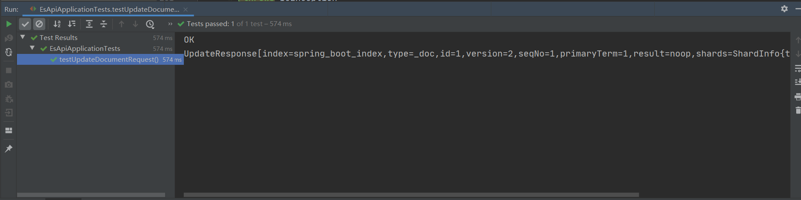
### 删除文档
```java
    /**
     * 删除文档内容
     *
     * @throws IOException
     */
    @Test
    void testDeleteDocumentRequest() throws IOException {
        //创建文档请求
        DeleteRequest deleteRequest = new DeleteRequest(INDEX_NAME, "1");
        deleteRequest.timeout(TimeValue.timeValueSeconds(1));
        //执行请求并获取响应结果
        DeleteResponse response = restHighLevelClient.delete(deleteRequest, RequestOptions.DEFAULT);
        System.out.println(response.status());
        System.out.println(response.toString());

    }
```

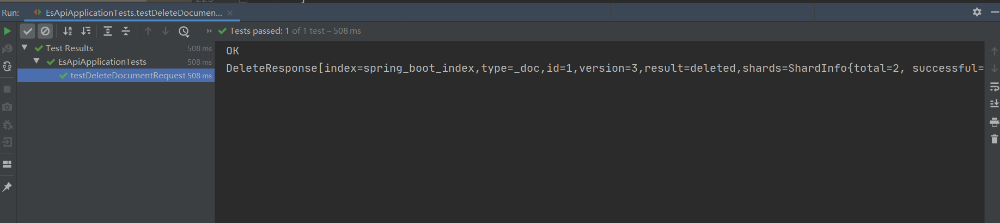
### 批量操作文档内容
```java
   /**
     * 批量操作文档内容
     *
     * @throws IOException
     */
    @Test
    void testBulkDocumentRequest() throws IOException {
        List<User> list = new ArrayList<>();
        for (int i = 0; i < 10; i++) {
            list.add(new User("z" + i, i + 10));
        }
        BulkRequest bulkRequest = new BulkRequest();
        bulkRequest.timeout(TimeValue.timeValueSeconds(10));

        //将对象转换为JSON
        ObjectMapper mapper = new ObjectMapper();
        for (int i = 0; i < list.size(); i++) {
            IndexRequest indexRequest = new IndexRequest(INDEX_NAME)
                    .id(String.valueOf(i+1))
                    .source(mapper.writeValueAsString(list.get(i)),XContentType.JSON);
            bulkRequest.add(indexRequest);
        }
        //执行请求并获取响应结果
        BulkResponse response = restHighLevelClient.bulk(bulkRequest, RequestOptions.DEFAULT);
        //是否失败 false 成功， true 失败
        System.out.println(response.hasFailures());
    }
    
```


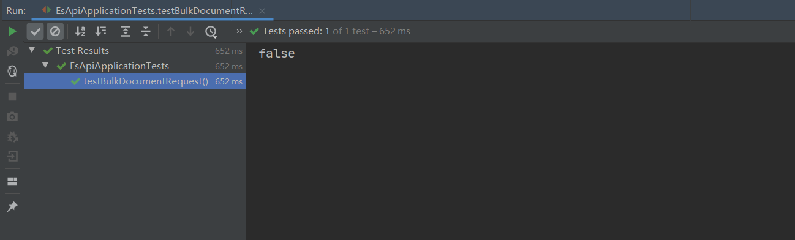

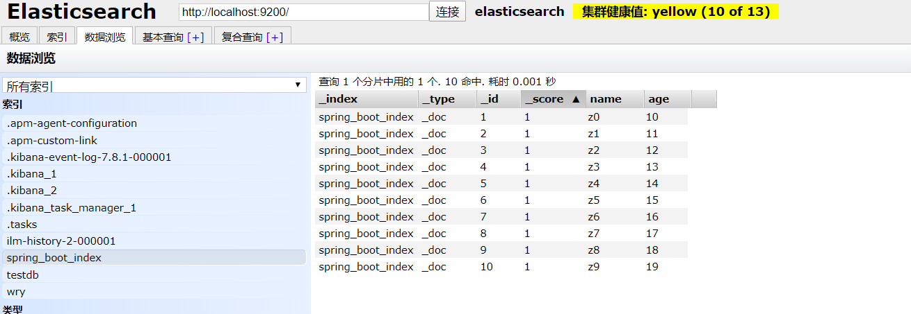

### 查询文档

```java

    /**
     * 查询文档内容
     *
     * @throws IOException
     */
    @Test
    void testSearchDocumentRequest() throws IOException {
        SearchRequest searchRequest = new SearchRequest(INDEX_NAME);
        //构建搜索条件
        SearchSourceBuilder sourceBuilder = new SearchSourceBuilder();
        //查询条件，通过 QueryBuilders 工具类实现
        //termQuery 精确匹配
        //matchAllQuery 匹配所有
        QueryBuilders.termQuery("name","z10");
        sourceBuilder.query();
        sourceBuilder.timeout(TimeValue.timeValueSeconds(10));

        SearchResponse response = restHighLevelClient.search(searchRequest, RequestOptions.DEFAULT);
        SearchHits hits = response.getHits();
        SearchHit[] hitsHits = hits.getHits();
        for (SearchHit hitsHit : hitsHits) {
            System.out.println(hitsHit);
        }
    }
```

